# painter

[](https://github.com/syaor4n/hermes-painter/actions/workflows/ci.yml)

<p align="center">
  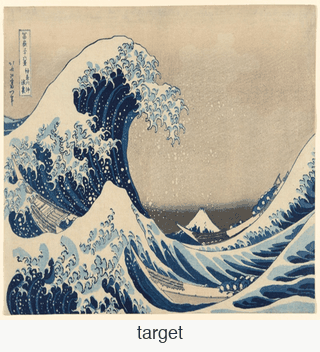
  <br/>
  <sub><i>Same prompt (<code>"a lonely fisherman at dusk"</code>, van_gogh, seed 42), painted three times as the agent's memory grows. Cold → primed after 5 → primed after 15. Contrast, palette, and atmosphere tighten without the caller changing a flag — the skills library has learned.</i></sub>
</p>

<p align="center">
  <b>This agent doesn't just paint. Its memory changes how it paints.</b>
</p>

**For developers and researchers exploring creative agents with persistent,
inspectable memory.** This is a testbed where every skill learned, every
reflection written, every parameter shift is committed to disk,
human-readable, and reproducible in one command.

An agent paints on a 512×512 HTML canvas stroke by stroke. After each
run it writes a reflection; a `skill_promote` pass distills recurring
patterns into skills with numeric parameter deltas; on the next run those
deltas sum and shift the pipeline's actual emission. You can watch the
arc happen and verify the mechanism at every step.

**The agent that paints is the CLI itself** — Claude Code, Hermes, or any
LLM driving the conversation. There is no second LLM inside this repo and
no API key required. Python only provides the canvas infrastructure, the
critic, and a tool server the CLI drives.

Submitted to the **Hermes Agent Creative Hackathon** (Kimi / NousResearch,
Apr 2026) — Creative Software track.

## Reproduce the memory arc in one command

```bash
make install-pil              # ~30 s, no browser needed for this path
python scripts/demo_memory_arc.py
```

The memory arc renders via PIL (the demo spawns its isolated viewer
with `--renderer pil`), so you can skip the ~200 MB Chromium download.
If you also want the live browser viewer later (for `make demo` or
`make judge-demo`), run `make install` instead — same flow, with
Playwright + Chromium added on top.

> **Always run judged commands through `.venv` or `make`.** The repo's
> declared dependencies (`scikit-image`, `pillow`, `playwright`) are
> installed into the venv, not your system Python. Running bare
> `python`/`pytest` outside `.venv` will hit `ModuleNotFoundError`.

That command spins up an **isolated sandbox** (no mutation of your real
`skills/` library), runs one cold paint with `apply_feedback=False` on
`targets/masterworks/great_wave.jpg`, then 5 priming paints on
feature-nearest same-image-type neighbors, runs `skill_promote` to
distill the reflections into skills, and finally re-paints the same
target with the promoted skills applied. The three canvases + a
side-by-side composite + a machine-readable summary all land in
`gallery/learning/<timestamp>/`:

- `run_cold.png` · `run_primed.png` · `side_by_side.png`
- `summary.json` — SSIMs, applied skills per run, effective parameter deltas, timings

Run takes **~5–7 min** on the default target (`great_wave.jpg`), much
less on simpler targets like `rothko_purple_white_red.jpg`.
`python scripts/demo_memory_arc.py --help` for
`--target / --style-mode / --seed / --priming` overrides.

### Under the hood — the dimensional-effects feedback loop

The hand-baked arc above was produced by priming the same target 15
times (0 / 5 / 15 snapshots) — showing the same mechanism the demo
reproduces on-demand with 5 priming runs:

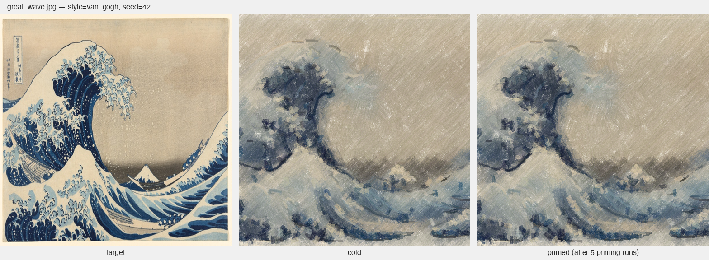

| snapshot | priming runs | applied skills | contrast_boost | **SSIM** | ground palette match |
|---|---:|---:|---:|:---:|---:|
| **run_00 (cold)** | 0 | 0 | 0.25 (+0.00) | **0.427** | 0.27 |
| **run_05** | 5 | 3 | 0.34 (+0.09) | **0.442** | 0.34 |
| **run_15** | 15 | 5 | 0.42 (+0.17) | **0.447** | 0.36 |

Each priming run writes a reflection. `skill_promote` scans recurring
`what_worked` phrases and promotes them to skills carrying numeric
parameter deltas. On the next paint, those deltas sum and shift the
pipeline's actual emission — `contrast_boost` drifts from `+0.00` →
`+0.09` → `+0.17` across the three snapshots without the caller asking
for it. SSIM rises, palette fidelity rises with it.

Full writeup: [`gallery/learning/comparison.md`](./gallery/learning/comparison.md).

## Gallery — single paints, varied styles

<p align="center">
  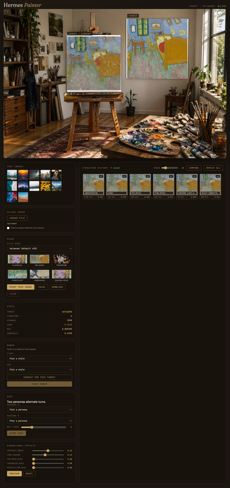
  <br/>
  <sub><i>The atelier-styled live viewer. Canvas on the easel fills in stroke by stroke against the target on the wall. Sidebar: test images, style presets, paint/morph/duet controls, and the dimensional-effects sliders that skills bias. Right rail: iteration history, replay, and compare.</i></sub>
</p>

Produced by `scripts/gallery_build.py` against the `targets/masterworks/`
set on 2026-04-22 (Apple M-series, headless Chromium, seed=42).

| Target | Painted | Style | SSIM · strokes · time |
|---|---|---|---|
| 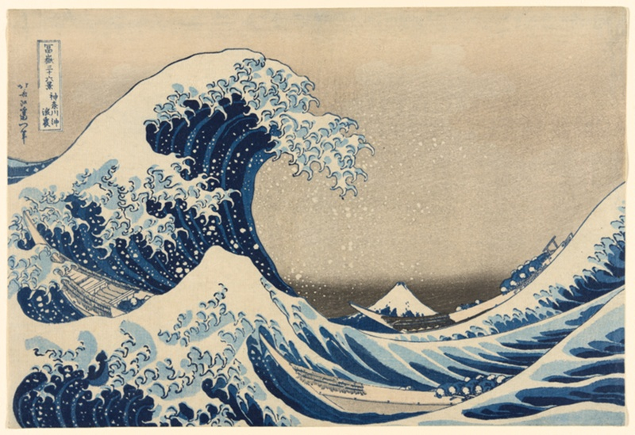 | 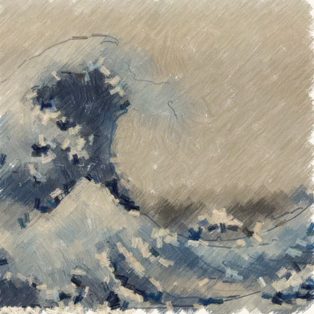 | default | 0.281 · 2 743 · 6.3 s |
| 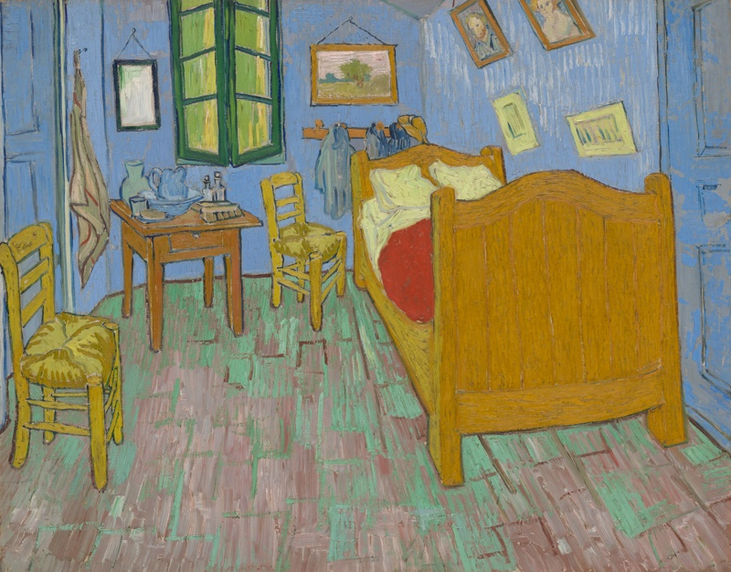 | 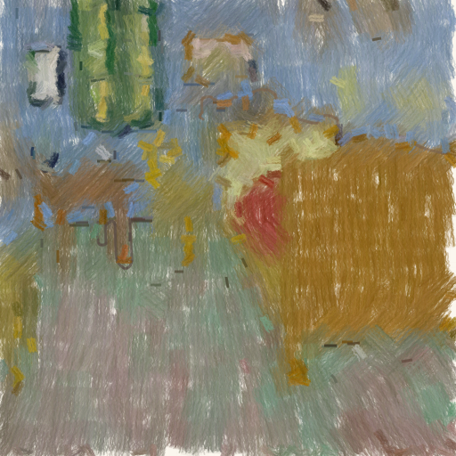 | van_gogh | 0.238 · 2 543 · 3.2 s |
| 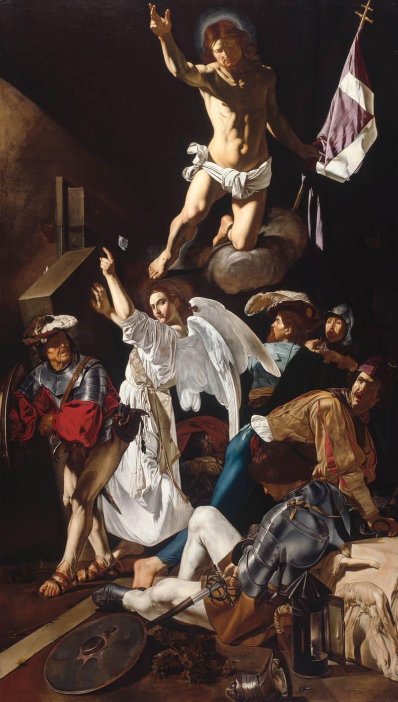 | 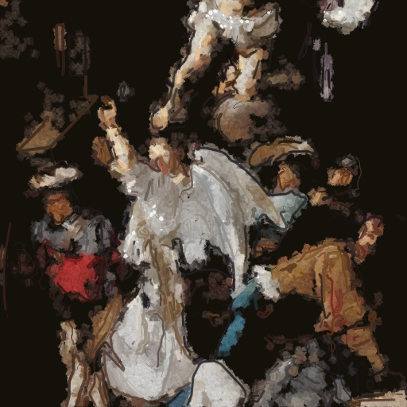 | tenebrism | 0.269 · 4 525 · 6.6 s |
| 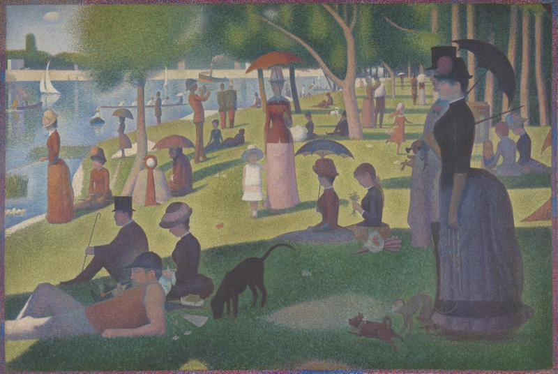 | 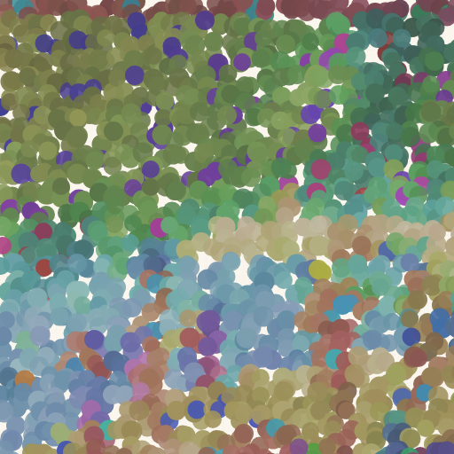 | pointillism | 0.296 · 12 288 · 2.0 s |

Raw metrics in `gallery/summary.json`. SSIM numbers are the compass, not the
goal — the scores above are representative of the 8-phase pipeline at its
current baseline.

---

## Also explored (experimental, secondary to the flagship above)

Two experimental directions built on the same painter substrate. They
showcase what the memory-arc infrastructure enables once the core loop
is solid — not replacements for the flagship.

### Style morph (experimental)

The Hermes agent can now plan a *morph* between two styles for a run,
via the `plan_style_schedule` tool in `/tool/manifest`. The canvas
starts in one style and drifts into another across the 8-phase
pipeline — Phase 1 interleaves strokes from both generators, Phases
2-8 interpolate style parameters continuously.

<p align="center">
  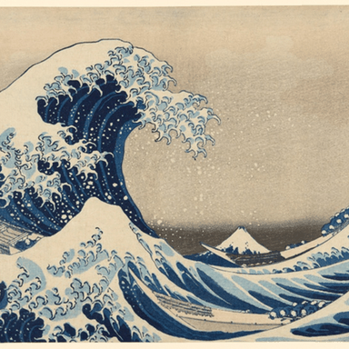
  <br/>
  <sub><i>Live iteration replay: <code>great_wave.jpg</code> painted <code>van_gogh → pointillism</code>. Target first, then each phase's canvas state in sequence.</i></sub>
</p>

Three demo rows, each shown next to a uniform-end control:

| Target | Morph output | Uniform-end control | Schedule |
|---|---|---|---|
| `caravaggio_resurrection` | 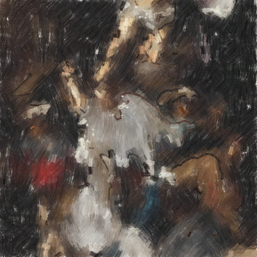 |  | `van_gogh → tenebrism` |
| `mona_lisa` | 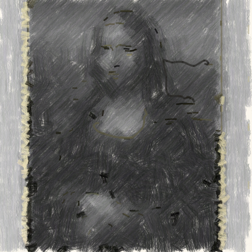 | 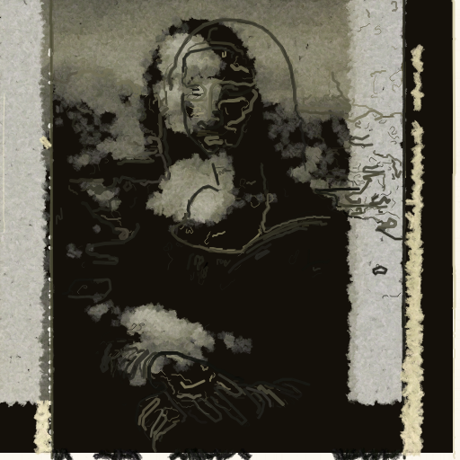 | `van_gogh → tenebrism` |
| `great_wave` | 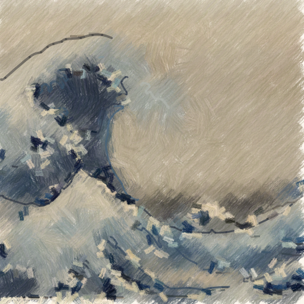 | 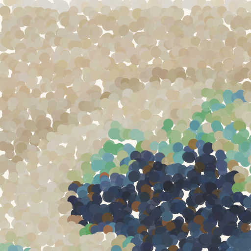 | `van_gogh → pointillism` |

Full rationales in [`gallery/morph/rationales.md`](./gallery/morph/rationales.md).

### Collaborative duet (experimental)

Two named *painter personas* alternate critique-and-correct turns on one
canvas. Each persona has a `style_mode`, a weighted list of failure
detectors it cares about, and a taste filter that picks which worst-cells
it has "legitimate claim" to correct. Turns are rejected on SSIM
regression, so the dialogue is committed to the journal honestly.

<p align="center">
  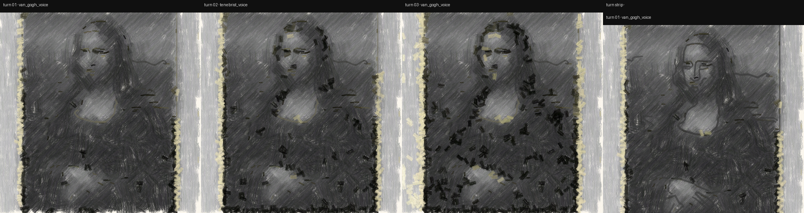
  <br/>
  <sub><i>Three turns of a duet on Mona Lisa: <code>van_gogh_voice</code> × <code>tenebrist_voice</code>. Panel 1 is the van_gogh opening; panels 2–3 alternate corrections. Plateau-detected after turn 3 (both personas converged).</i></sub>
</p>

Three demo duets, each shown next to its solo-opening control:

| Target | Duet | Solo control | Personas | Journal |
|---|---|---|---|---|
| `mona_lisa` | 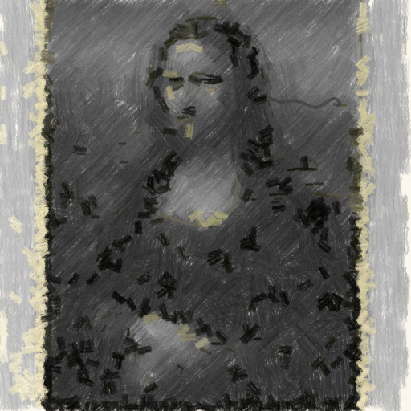 | 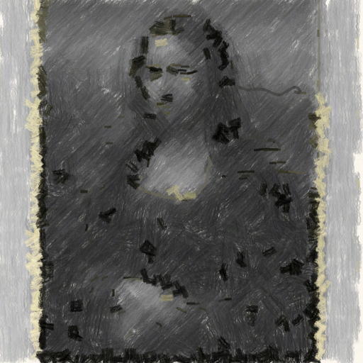 | `van_gogh_voice × tenebrist_voice` | [📝](./gallery/duet/mona_lisa_vangogh_vs_tenebrist/duet_journal.md) |
| `great_wave` | 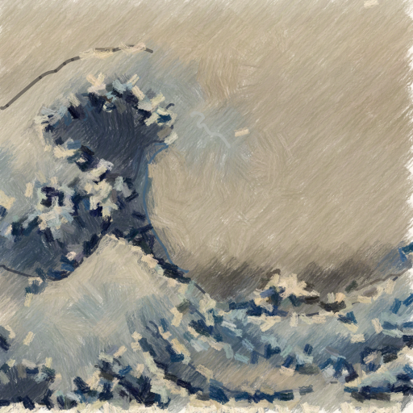 | 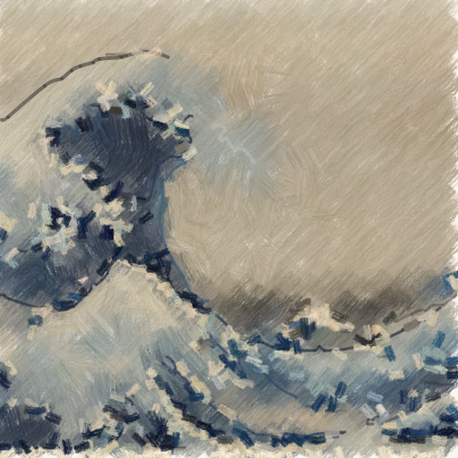 | `van_gogh_voice × pointillist_voice` | [📝](./gallery/duet/great_wave_vangogh_vs_pointillist/duet_journal.md) |
| `caravaggio` | 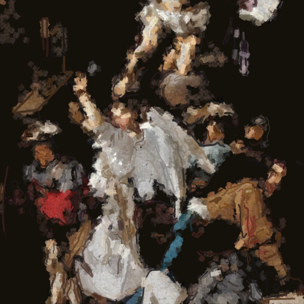 | 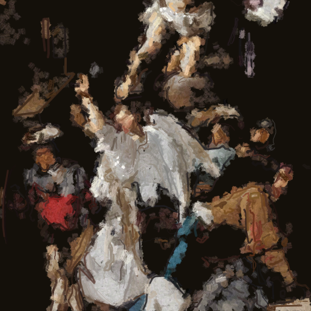 | `tenebrist_voice × van_gogh_voice` | [📝](./gallery/duet/caravaggio_tenebrist_vs_vangogh/duet_journal.md) |

New tools in the manifest: `paint_duet`, `list_personas`.
Persona library: [`personas/README.md`](./personas/README.md).

## Architecture

```
 ┌──────────────────┐                         ┌─────────────────┐
 │ CLI agent        │    JSON tool calls      │  hermes_tools   │
 │ (Claude Code /   │────────────────────────▶│  :8765          │
 │  Hermes /        │                         │                 │
 │  you by hand)    │                         └────────┬────────┘
 └──────────────────┘                                  │
                                                       ▼
                                                ┌──────────────┐
                                                │ viewer :8080 │──▶ canvas
                                                │              │◀── screenshot
                                                └──────────────┘
                                                       │
                                                       ▼
                                  skills/ • journal.jsonl • style/
```

- `scripts/viewer.py` → the canvas (Playwright + HTML) with a human UI and HTTP API on `:8080`
- `scripts/hermes_tools.py` → 49 JSON tools for an external agent on `:8765` (`curl localhost:8765/tool/manifest`)
- `scripts/paint_lib/` → the reusable multi-phase `auto_paint` pipeline (phases split under `phases_pkg/`); also exposes `paint_duet` and the morph scheduler
- All of `src/painter/*.py` → shared infrastructure (renderer, critic, skills, journal, style)
- `tests/test_renderer_parity.py` → pixel-MAE check across 12 stroke fixtures between `local_renderer.py` and `canvas/index.html`

## Quick start

```bash
python -m venv .venv && source .venv/bin/activate
pip install -e .
playwright install chromium

make demo   # starts viewer :8080 + tool server :8765 + opens the UI
```

No `make`? Same thing by hand:

```bash
PYTHONPATH=src .venv/bin/python scripts/viewer.py &        # canvas :8080
PYTHONPATH=src .venv/bin/python scripts/hermes_tools.py &  # tools  :8765
open http://127.0.0.1:8080
```

Both servers bind to `127.0.0.1` by default — the tool layer reads
arbitrary files via `load_target`, so don't expose them publicly.

## Demo: run it with `hermes` in 30 seconds

This repo ships with an [`AGENTS.md`](./AGENTS.md) that Hermes (the
Nous Research CLI agent) reads automatically on session start. Pick
any of these one-liners and watch the agent work:

```bash
hermes "Paint targets/masterworks/the_bedroom.jpg in van_gogh style. \
        Dump the final canvas and describe what you painted."
```

```bash
hermes "Load targets/masterworks/caravaggio_resurrection.jpg. Call \
        plan_style_schedule and tell me the rationale. Then auto_paint \
        the target with that schedule and report the final SSIM."
```

```bash
hermes "Run a paint_duet on targets/masterworks/mona_lisa.jpg with \
        personas van_gogh_voice and tenebrist_voice, max_turns=4. \
        Summarize each turn's SSIM delta."
```

```bash
hermes "Paint targets/masterworks/great_wave.jpg with auto_paint. Then \
        read skills/ and journal.jsonl. Paint it a second time. Tell \
        me which skills fired and what changed between the two canvases."
```

```bash
hermes "Load targets/masterworks/seurat_grande_jatte.jpg. Plan and \
        draw 4 iterations of strokes stroke-by-stroke (no auto_paint) \
        via the score_plan / draw_strokes imagination loop. Save a \
        reflection at the end."
```

The human opens `http://127.0.0.1:8080` to watch strokes land in real
time. Click the easel canvas in the viewer to zoom in at native 512×512
resolution. See [`AGENTS.md`](./AGENTS.md) for the agent runbook and
[`HERMES.md`](./HERMES.md) for the full agent playbook.

## The agent's loop

Implemented by the CLI agent in conversation. Each action is one HTTP call.

For exploratory painting:

```
1. load_target(path)        → classification + upload target to the viewer
2. analyze_target()         → one-shot strategy dict (grid/direction/fog/complexity)
3. list_skills(image_type)  → scoped prior techniques
4. read_style() / list_journal(n=8)

Repeat until good enough:
5. get_regions(top=16)      → 8×8 cells sorted by error, with target/current RGB
6. dump_heatmap() + Read    → visually inspect error distribution
7. score_plan({strokes})    → IMAGINE a plan (render locally, return delta_ssim)
8. snapshot()               → restore point
9. draw_strokes({strokes})  → apply, get new score
10. dump_canvas() + Read    → visually inspect your work
11. restore(id)             → rollback if a plan regressed

Finally:
12. save_skill / save_journal_entry / update_style
```

For one-shot painting in the painter's own style, `scripts/paint_lib.auto_paint()`
orchestrates an 8-phase pipeline the CLI can invoke directly:

```
Phase 0  saliency_mask           → foreground/background mask (optional)
Phase 1  underpainting           → grid-sampled bristle brush
                                   (per-cell angle via direction_field_grid,
                                    per-region palette via segment_regions,
                                    tanh contrast boost)
Phase 2  fog                     → atmospheric gradient (subject-dependent)
Phase 3  edge_stroke_plan        → smooth brush following moderate edges
Phase 4  gap-fill                → if coverage < 95 %
Phase 5  detail_stroke_plan ×2   → mid (α 0.55, contrast) + fine (α 0.95, dark)
Phase 6  contour_stroke_plan     → Canny skeletons as bezier curves
Phase 7  highlight_stroke_plan   → warm bright dabs at local maxima
Phase 8  critique_correct        → touch-up passes on worst-error cells (opt.)
```

## Tool manifest

```bash
curl localhost:8765/tool/manifest
```

**Core (canvas I/O):**
| Tool | Purpose |
|------|---------|
| `load_target` | Upload an image + get classification |
| `draw_strokes` | Apply a plan (batch) and get the new score |
| `score_plan` | Imagine a plan locally — returns `imagined.ssim` and `delta_ssim` |
| `clear`, `snapshot`, `restore` | Reset / save / roll back the canvas |
| `get_state`, `get_heatmap`, `get_regions` | Live state + error signal |

**Visual inspection (agent must LOOK):**
| Tool | Purpose |
|------|---------|
| `dump_canvas`, `dump_target`, `dump_heatmap`, `dump_all` | Write PNGs to `/tmp/` for the agent's `Read` tool |
| `sample_target` | Mean color at (x,y,w,h) on the target |
| `sample_grid` | Batch-sample all cells of a gx×gy grid in one call |
| `find_features` | Sun / horizon / darkest-region / warmth / rule-of-thirds |
| `get_palette` | Top-N dominant colors |
| `dump_gaps` | Target-aware coverage mask + fraction painted |

**Target analysis (strategy):**
| Tool | Purpose |
|------|---------|
| `edge_map` | Sobel edges + subject-region bbox + edge density |
| `gradient_field` | Quadrant-vote dominant direction (horizontal/vertical/random) |
| `direction_field_grid` | Per-cell angle + coherence (structure tensor) |
| `saliency_mask` | Laplacian-variance foreground mask → `/tmp/painter_saliency.png` |
| `segment_regions` | SLIC super-pixels + per-region palette + dominant angle |
| `analyze_target` | One-shot strategy dict used by `paint_lib.auto_paint` |

**Stroke plans (no application, just plan generation):**
| Tool | Purpose |
|------|---------|
| `edge_stroke_plan` | Brush strokes following moderate-percentile edges (auto budget 40–250) |
| `detail_stroke_plan` | Thin polylines on strong edges (mask-aware) |
| `contour_stroke_plan` | Canny skeleton tracing → bezier curves (mask-aware) |
| `highlight_stroke_plan` | Warm bright dabs at local maxima (mask-aware) |

**Agent memory:**
| Tool | Purpose |
|------|---------|
| `list_skills`, `save_skill` | YAML-frontmatter skill library (scope, tags, confidence) |
| `list_journal`, `save_journal_entry` | Cross-run causal log |
| `read_style`, `update_style` | Persistent style signature |

## Stroke vocabulary

Implemented by `canvas/index.html` and mirrored by `src/painter/local_renderer.py`:

```
{"type": "fill_rect",   "x", "y", "w", "h", "color"}
{"type": "fill_circle", "x", "y", "r", "color"}
{"type": "fill_poly",   "points": [[x,y]…], "color"}
{"type": "polyline",    "points": [[x,y]…], "color", "width"}
{"type": "line",        "points": [[x0,y0],[x1,y1]], "color", "width"}
{"type": "bezier",      "points": [p0, c1, c2, p1], "color", "width"}
{"type": "brush",       "points": [[x,y]…], "color", "width",
                        "texture": "bristle"|"smooth"}            # bristle = real paint
{"type": "dab",         "x", "y", "w", "h", "angle", "color"}     # oriented ellipse
{"type": "splat",       "x", "y", "r", "color", "count"}          # clustered dots
{"type": "fog",         "x", "y", "w", "h", "color",
                        "direction": "horizontal"|"vertical"|"radial",
                        "fade"}                                   # atmospheric gradient
{"type": "glow",        "x", "y", "r", "color"|"stops"}           # radial gradient
```

Optional `alpha` (0–1). Colors are `#RRGGBB`. Canvas is 512×512. Origin top-left.
Per-type alpha defaults (matching the canvas JS): `brush`=0.85, `dab`=0.9,
`splat`=0.7, everything else=1.0.

## Skills with YAML frontmatter

```markdown
---
scope:
  image_types: [balanced]
  exclude: [night]
provenance:
  run: 20260420_162504_sunset
  delta_ssim: 0.6859
  target: targets/sunset.jpg
confidence: 3
tags: [sunset, warm, gradient]
---
For balanced/warm sunset targets, the big SSIM win comes from two
coarse fill_rect: warm top band + dark band. Detailed gradients via
multiple thin bands REGRESSES SSIM — the metric penalizes structured
edges that don't exist in smooth target gradients.
```

The loader:
- filters out legacy per-run critique files by name pattern;
- keeps only skills whose scope matches the target's image type;
- caps per-skill body at 800 chars, total context at 6 KB;
- sorts: frontmatter skills first, then by `confidence` desc.

## Layout

```
painter/
├── canvas/index.html                 # window.painter.{clear, drawStroke, drawStrokes,
│                                     #   snapshot, restore, dropSnapshot, getPNG}
├── src/painter/
│   ├── browser.py                    # Playwright wrapper (batch + snapshot)
│   ├── critic.py                     # SSIM, MS-SSIM, MSE, heatmap, regions, score_plan
│   ├── executor.py                   # one-call batch stroke application
│   ├── image_type.py                 # 5-class classifier for skill scoping
│   ├── journal.py                    # cross-run JSONL ledger
│   ├── local_renderer.py             # PIL-based stroke simulator (parity with canvas)
│   ├── reflection.py                 # end-of-run heuristic skill writer
│   ├── skills.py                     # YAML frontmatter + scope filter + confidence
│   └── style.py                      # persistent style signature
├── scripts/
│   ├── viewer.py                     # canvas + human UI + HTTP API on :8080
│   ├── hermes_tools.py               # tool server on :8765 for the CLI agent
│   ├── paint_lib/                    # multi-phase pipeline + no-target brief mode
│   ├── auto_paint.py                 # viewer-invoked wrapper over paint_lib
│   ├── paint_live.py                 # legacy CLI bridge to the viewer
│   ├── reflect.py                    # post-hoc skill writer for an existing run
│   ├── timelapse.py                  # stitch step_*.png → timelapse.gif
│   ├── demo_stroke.py                # sanity test
│   └── make_test_target.py           # seed target
├── skills/
│   ├── *.md                          # techniques (YAML frontmatter for new ones)
│   └── style/signature.md            # the painter's persistent style essay
├── journal.jsonl                     # per-run causal log (created on first run)
├── targets/                          # reference images to paint
└── runs/                             # timelapse, plans, scores, traces
```

## Viewer HTTP API (port 8080)

The tool server proxies most of these; the viewer is usable directly if
you prefer a thinner agent.

| Method | Path                 | Purpose                                             |
|--------|----------------------|-----------------------------------------------------|
| GET    | `/`                  | Live UI                                             |
| GET    | `/api/state`         | Canvas b64 + score + history                        |
| GET    | `/api/iteration/{N}` | Snapshot of iteration N                             |
| GET    | `/api/target`        | Current target (b64)                                |
| GET    | `/api/heatmap`       | PNG heatmap of \|target − current\|                 |
| GET    | `/api/regions`       | Top 24 worst 8×8 cells with target/current means    |
| POST   | `/api/stroke`        | Apply a single stroke spec                          |
| POST   | `/api/plan`          | Apply `{"strokes":[…]}` in one batch                |
| POST   | `/api/score_plan`    | Imagine a plan; return `{imagined: {...}}`          |
| POST   | `/api/snapshot`      | Capture restore point → `{"id": …}`                 |
| POST   | `/api/restore`       | Restore `{"id": …}`                                 |
| POST   | `/api/clear`         | Reset canvas to white                               |
| POST   | `/api/target`        | Set target (multipart upload or raw PNG)            |

Server is `ThreadingHTTPServer`; snapshots are capped at 40 entries
(oldest dropped). No auth — bind to localhost if untrusted.

## Example: CLI agent driving a full painting

```bash
# 1. tell the viewer which image to paint
curl -X POST localhost:8765/tool/load_target \
  -d '{"path":"targets/sunset.jpg"}' -H 'Content-Type: application/json'

# 2. get context
curl -X POST localhost:8765/tool/list_skills \
  -d '{"image_type":"balanced"}' -H 'Content-Type: application/json'
curl -X POST localhost:8765/tool/get_regions \
  -d '{"top":16}' -H 'Content-Type: application/json'

# 3. imagine 2 candidate plans
curl -X POST localhost:8765/tool/score_plan -d @plan_a.json
curl -X POST localhost:8765/tool/score_plan -d @plan_b.json

# 4. apply the winner
curl -X POST localhost:8765/tool/draw_strokes -d @winner.json

# 5. save what you learned
curl -X POST localhost:8765/tool/save_skill -d @lesson.json
curl -X POST localhost:8765/tool/save_journal_entry \
  -d '{"run":"...","target":"targets/sunset.jpg","final_ssim":0.68,"note":"2-band coarse > gradient"}'
```

## Design philosophy

The painter is not a pixel-matching engine — SSIM is a compass, not a goal.
The agent is trusted to interpret the target, develop a style, and
accumulate its own technique library. The infrastructure (imagination,
rollback, scoped skills, journal, style signature) exists to make that
trust safe: the agent can experiment without losing work, remember what
worked, and articulate what it values.

The choice to let the CLI's LLM be the planner — rather than embedding a
second LLM call — keeps the repo dependency-free of any API, minimizes
cost, and puts the full context of the conversation at the planner's
disposal. When Claude Code paints, the same model that reads the user's
request and plans strokes is also the one that wrote the skills it
reads. That continuity is what makes a style possible.

## Benchmarking

```bash
python scripts/timelapse.py runs/<your-run> --fps 3
```

For multi-target comparison, the CLI agent orchestrates:
paint target A → save score → clear → paint target B → compare.
There is no automated bench script because the "strategy" under test
is the CLI agent's own judgement, which can't be called from Python
without re-embedding an API.

## Project docs

| File | What's in it |
|---|---|
| [`HERMES.md`](./HERMES.md) | Onboarding for the painting agent — loop, anti-patterns, style-signature semantics |
| [`CHANGELOG.md`](./CHANGELOG.md) | Distilled v4→v15 history + Unreleased section |
| [`skills/style/signature.md`](./skills/style/signature.md) | The painter's first-person style essay (it rewrites this itself) |
| [`skills/*.md`](./skills) | YAML-frontmatter skill library, filtered at load time by image type |
| [`journal.jsonl`](./journal.jsonl) | _(created on first run)_ — append-only cross-run causal log |

## Roadmap (left open)

Shipped between v5 and v9:

- ✅ Saliency-based foreground/background mask
- ✅ Per-cell stroke direction from local structure tensor
- ✅ SLIC segmentation with per-region palette + angle
- ✅ Canny-skeleton contour tracing as bezier curves
- ✅ Highlight dabs at local maxima
- ✅ Contrast S-curve in the underpainting
- ✅ Critique-correct loop on worst-error cells
- ✅ Best-of-N seeds
- ✅ Animated iteration replay on the webui, with speed/pause/step controls
- ✅ Pixel-parity tests between PIL and canvas renderers

Open:

- LAB-space k-means palette extraction (currently RGB-binned).
- MCP server mode for the tool layer (currently plain HTTP + JSON).
- Collaborative painters (two CLI agents with different styles taking turns).
- OffscreenCanvas Worker to render bristle strokes off the main thread
  (v9 batch-sample optimization already brought paint time from 9s → 3s,
  reducing the payoff).
- Full-vector SVG export.
